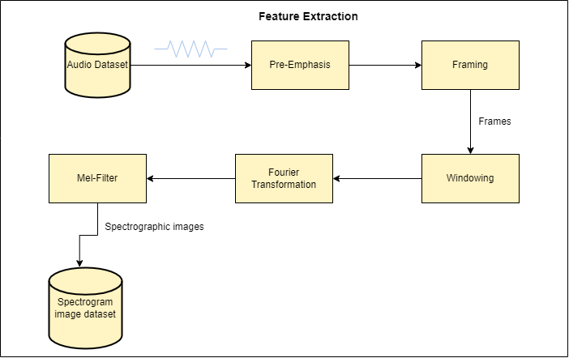

# Spoken Language Identification
This project main aim is to detect the language using log-mel spectrogram

## Folder Description : 
This repository contains 2 notebooks which are 
1. Spectrogram_conversion (1).ipynb : This notebook help us convert the audio files into log-mel sepctrograms .
2. log_mel_INDIA_dataset_.ipynb : This notebook contains the model implementation (CNN, ResNet, Inceptionv3).

### Dataset Used :
We use the dataset that was used by [Sreedhar Potal](https://www.semanticscholar.org/paper/Speech-Database-for-Speech-Analysis-Banavath-Potla/742a82fc8f4b1ad75e02933964db72bfddc57aea)

Note : we have pytorch version of it also.
